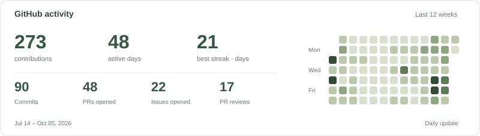

# Hi, I'm Zhigang.

Data infrastructure, open source, and small tools that make everyday life better.

I work on data systems and build things across **Rust, Go, and Python** — from developer tools to a little display on my desk.

### Things I build

- **[Glance](https://github.com/wangzhigang1999/glance)** — A little window into your digital life — GitHub activity and your connected home, right on your desk.
- **[CouchPilot](https://github.com/wangzhigang1999/couchpilot)** — Vibe code from the couch. Drive your AI coding workflow with a gamepad.

### Around here

Lakehouses · Query engines · Developer tools · Embedded Rust

[Repositories](https://github.com/wangzhigang1999?tab=repositories) · [Pull requests](https://github.com/pulls?q=is%3Apr+author%3Awangzhigang1999+is%3Apublic) · [A small meme project](https://github.com/wangzhigang1999/memes)
